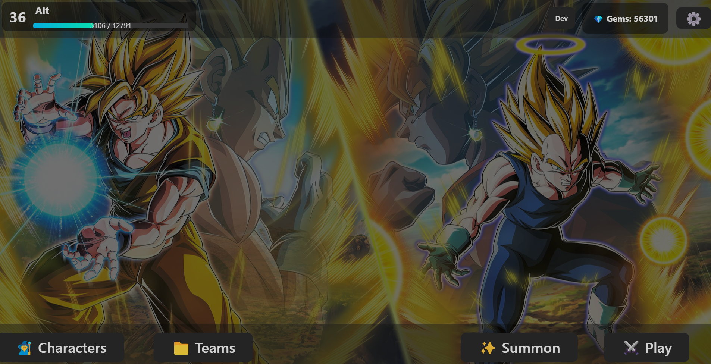

# My Gacha is Blue
 A fast, fun, lightweight gacha experience!

 Play now: [mygachaisblue.vercel.app](https://mygachaisblue.vercel.app)

---

## 🖼️ Screenshots

  
   <em>🔹 The main hub where you can summon, battle, and more.</em>

---

🎮 **Features**:

☁️ **Cloud Storage**
- Link your Google account to store data forever across devices!

🧑‍💻 **Guest Mode**
- No account? No problem. Play instantly saving data locally within your device!

🖥️ **Cross-Platform**
- On mobile? On xbox? On your Samsung refridgerator? No problem!

✨ **Summon System**
- Fun summon animations with dynamic outcomes and special clips based on what you pull!

🧍 **Diverse Roster**
- Collect characters from various universes, each with unique kits and stats for variety!

⚔️ **Hybrid Battle Mechanics**
- A strategic Dokkan Battle x Pokémon battle system: stack stats, switch out tactically, and plan your moves to win!

🛠️ **Status Effects**
- Utilize guard, damage reduction, evasion, and other mechanics tactically!

🎵 **Character Themes**
- Enjoy the unique themes of each character!

💖 **Favorites**
- Set your favorite unit on your profile, showing them off on your player card.

📈 **Leveling System**
- Earn EXP and level up as you play!

🎲 **Trait Rolls & Limit Breaks**
- Add depth to your units with rerollable traits and applied limit breaks that add variance and personalization!

🧠 **Advanced Teambuilding**
- Craft unique team setups with synergy and strategy accounted for!

🔥 **Challenging Encounters**
- Take on diverse battles with unique mechanics, bosses, and strategies to win!

**And More!**
- More updates including units, stages, and mechanics will drop soon!

---

📌 Note
All credits go to the respective owners this was a nonprofit project made for fun
